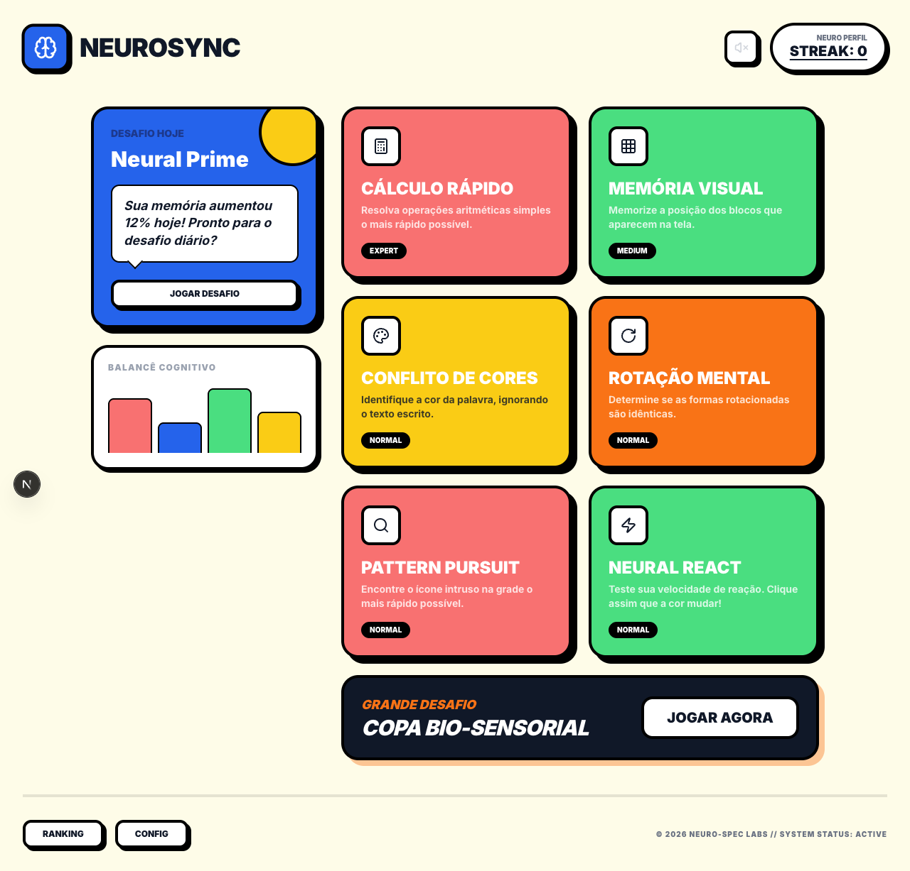

# NeuroSync

NeuroSync is a cognitive training app built with Next.js, React, Tailwind CSS, and Motion. It includes short interactive exercises for arithmetic speed, memory, color conflict, spatial reasoning, visual search, and reaction time, now backed by persistent auth, score storage, and a global ranking.



## Features

- Daily challenge flow with local streak tracking
- Multiple puzzle modes with difficulty selection
- Tutorial overlays for supported games
- Email/password signup and signin with HTTP-only sessions
- Persistent score history stored with Drizzle + LibSQL/Turso
- Global ranking view with synced top scores
- Local browser storage for in-session progress and streaks
- Brutalist visual style with animated UI transitions

## Tech Stack

- Next.js 16
- React 19
- TypeScript
- Tailwind CSS 4
- Motion
- Lucide React
- Drizzle ORM
- LibSQL / Turso
- JOSE
- bcryptjs
- Zod
- Vitest

## Run Locally

**Prerequisites:** Node.js 20+ recommended

```bash
npm install
npm run dev
```

Open `http://localhost:3000`.

## Environment

Copy `.env.example` to `.env.local` and set the values you need:

```bash
cp .env.example .env.local
```

- `GEMINI_API_KEY`: enables AI-powered parts of the app
- `SESSION_SECRET`: required for signed auth sessions; use at least 32 characters
- `TURSO_DATABASE_URL`: optional locally; defaults to `file:./.neurosync-local.db`
- `TURSO_AUTH_TOKEN`: required when using a remote Turso database

## Database

The app uses Drizzle with LibSQL. For local development, it falls back to a SQLite-compatible file database when `TURSO_DATABASE_URL` is not set.

```bash
npm run db:generate
npm run db:push
```

## Scripts

```bash
npm run dev
npm run build
npm run start
npm run lint
npm run test
npm run db:generate
npm run db:push
```

## Notes

- Local gameplay stats still use browser storage under `neurosync_stats`
- Authenticated runs also persist users and results in the database
- Rankings are exposed through the app API and require a valid session
